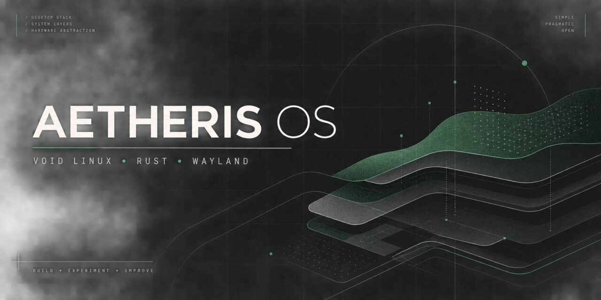

<div align="center">



# Aetheris OS

**A responsive, hardware-aware desktop operating system built on Void Linux and Wayland.**

[](https://voidlinux.org/)
[](http://smarden.org/runit/)
[](https://www.rust-lang.org/)
[](https://en.wikipedia.org/wiki/C_(programming_language))
[](https://wayland.freedesktop.org/)
[](https://github.com/amandeavor/Aetheris-OS/actions/workflows/quality.yml)
[](https://github.com/amandeavor/Aetheris-OS/stargazers)

<p align="center">
  <a href="#overview">Overview</a> •
  <a href="#subsystems--components">Subsystems</a> •
  <a href="#modular-pipeline">Architecture</a> •
  <a href="#contributor-quickstart">Quickstart</a> •
  <a href="#verification-matrix">Verification</a> •
  <a href="#roadmap--governance">Governance</a>
</p>

</div>

---

> [!IMPORTANT]
> **Stage: Prototype & Systems Engineering.**
> Aetheris OS contains buildable components, declarative hardware profiles, preloading daemons, and system packaging, but **no public ISO release exists yet**. The codebase is currently structured for contributors, reviewers, and systems researchers.

---

## Overview

Most modern desktop distributions assemble upstream components with minimal integration between the driver layer, memory subsystem, and desktop shell. 

**Aetheris OS** pairs the speed and simplicity of **Void Linux** (`runit` + `xbps`) with bespoke, modern integration layers:

- **Hardware-Aware Driver Profiling**: Declarative PCI/USB driver matching in Rust (`chwd_port`).
- **Predictive Page Cache Warming**: C and SQLite transition-learning daemon (`velocitymind`).
- **Unified Graphical App Store**: Native desktop management across XBPS and Flatpak (`velocitystore`).
- **Wayland Desktop Experience**: Curated `labwc` compositor, `sfwbar` panel, and spring-physics animations.
- **Explicit Isolation & Security**: Declarative AppArmor sandboxing, nftables firewalling, and UKI signing.

---

## Subsystems & Components

```
                    ┌──────────────────────────────────────────────┐
                    │           Aetheris OS Architecture           │
                    └──────────────────────┬───────────────────────┘
                                           │
         ┌──────────────────┬──────────────┼──────────────────┬──────────────────┐
         ▼                  ▼              ▼                  ▼                  ▼
  ┌──────────────┐   ┌──────────────┐ ┌──────────────┐ ┌──────────────┐ ┌──────────────┐
  │  chwd_port   │   │ velocitymind │ │velocitystore │ │velocitysetup │ │System Overlay│
  │ Hardware &   │   │  Predictive  │ │ XBPS/Flatpak │ │  First-boot  │ │ AppArmor, UDev│
  │ PCI drivers  │   │  Preloader   │ │  App Store   │ │  Onboarding  │ │ & Wayland/WM │
  │    (Rust)    │   │ (C + SQLite) │ │(Tauri+Svelte)│ │ (GTK4/Adw)   │ │ (Void+runit) │
  └──────────────┘   └──────────────┘ └──────────────┘ └──────────────┘ └──────────────┘
```

| Component | Subsystem & Purpose | Implementation Stack | Maturity Status |
| :--- | :--- | :--- | :--- |
| **`chwd_port`** | Hardware detection, vendor PCI/USB matching, and automated driver orchestration. | Rust 2021 | **Buildable Prototype** |
| **`velocitymind`** | Predictive desktop preloader tracking window focus events to warm binaries into page cache. | C99, SQLite 3, POSIX | **Buildable Prototype** |
| **`velocityinstall`**| System installer, automated btrfs subvolume layout, and user provisioning. | Rust, Tauri v2, Svelte | **Early Prototype** |
| **`velocitystore`**  | Unified GUI software catalog managing XBPS system packages and Flatpaks. | Rust, Tauri v2, Svelte | **Early Prototype** |
| **`velocitysetup`**  | First-boot onboarding wizard for timezone, network, and accessibility setup. | Rust, GTK4, Libadwaita | **Early Prototype** |
| **`srcpkgs`**        | Custom Void Linux XBPS package templates and kernel configuration patches. | XBPS, Shell | **Experimental** |
| **`config` / `etc`** | Wayland compositor configs (`labwc`), panel (`sfwbar`), and AppArmor profiles. | Shell, XML, Conf | **Experimental** |

---

## Modular Pipeline

Each component is **completely decoupled** so you can develop, test, and contribute to individual subsystems without needing a full Void Linux virtual machine or building an entire ISO image:

```
[ 1. Hardware Detection & Drivers ]
  PCI & USB Hardware ──► sysfs/udev ──► chwd_port (Rust) ──► Kernel Modules & Profiles

[ 2. Predictive Runtime Acceleration ]
  Window Focus Events ──► Desktop Session ──► velocitymind (C) ──► Page Cache (posix_fadvise)

[ 3. Desktop Shell & Application Management ]
  Wayland Session ──► Labwc Compositor ──► Sfwbar Panel ──► VelocityStore (XBPS + Flatpak)
```

---

## Contributor Quickstart

### 1. Clone the repository

```bash
git clone https://github.com/amandeavor/Aetheris-OS.git
cd Aetheris-OS
```

### 2. Verify individual components locally

#### A. Hardware Utility (`chwd_port` in Rust)
```bash
# Check formatting and compilation
cargo fmt --manifest-path chwd_port/Cargo.toml -- --check
cargo check --locked --manifest-path chwd_port/Cargo.toml
```

#### B. Preloader Daemon (`velocitymind` in C)
```bash
# Compile preloader with strict compiler warnings
make -C velocitymind CFLAGS="-Os -Wall -Wextra -Werror"
```

#### C. Shell Scripts & System Services
```bash
# Run ShellCheck on all setup and runit scripts
shellcheck --severity=error config/sfwbar/*.sh usr/bin/*
```

---

## Verification Matrix

To ensure stability across all subsystems, each component is audited against standard verification tiers:

| Subsystem | Source Location | Build Command | Verification Scope |
| :--- | :--- | :--- | :--- |
| **Hardware Tooling** | `chwd_port/` | `cargo check` | PCI parsing & profile syntax |
| **Preload Daemon** | `velocitymind/` | `make -C velocitymind` | SQLite transition logging & memory safety |
| **Desktop Configs** | `config/labwc/` | `labwc --validate` | Wayland keybindings & window rules |
| **Panel Layouts** | `config/sfwbar/` | `sfwbar -c ...` | CSS styling & widget hierarchy |
| **Security Rules** | `etc/apparmor.d/` | `apparmor_parser -d` | Policy parsing & confinement rules |

*See [docs/component-status.md](docs/component-status.md) for full subsystem audit logs.*

---

## Roadmap & Governance

We prioritize focused, verified engineering over speculative feature lists:

1. **Phase 1**: Full unit and fixture test coverage for `chwd_port` and `velocitymind`.
2. **Phase 2**: Reproducible containerized Void Linux ISO build toolchain.
3. **Phase 3**: First signed, bootable developer preview ISO for community testing.

- [Contributing Guidelines](CONTRIBUTING.md)
- [Architecture Specifications](docs/01-architecture-overview.md)
- [Governance & Maintainer Pathway](GOVERNANCE.md)
- [Security Disclosure Policy](SECURITY.md)
- [Technical Debt Register](TECHNICAL_DEBT.md)
- [Component Status Matrix](docs/component-status.md)

---

## Community & Discussions

- **Discussions**: Use [GitHub Discussions](https://github.com/amandeavor/Aetheris-OS/discussions) for architecture ideas and questions.
- **Issue Tracker**: Browse [`good first issue`](https://github.com/amandeavor/Aetheris-OS/labels/good%20first%20issue) and [`help wanted`](https://github.com/amandeavor/Aetheris-OS/labels/help%20wanted) tickets.
- **Maintainership**: Interested in co-maintaining a specific subsystem? Review [GOVERNANCE.md](GOVERNANCE.md).

---

## License Status

A repository-level open-source license has not yet been selected. Resolving the repository license is a release blocker tracked in [ROADMAP.md](ROADMAP.md).
